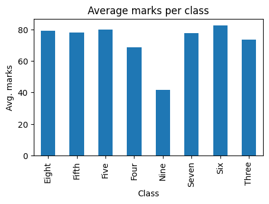
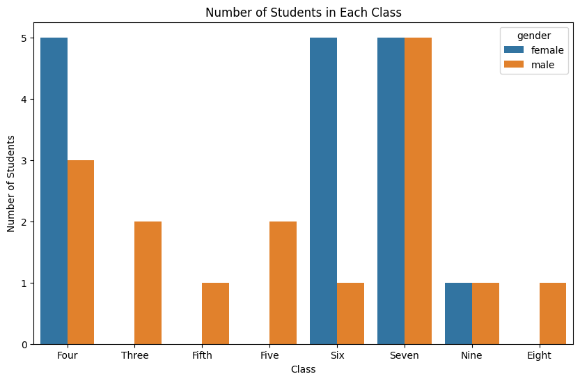

# Student Data Analysis in Python

## Project Overview 
 
This project uses Python and Pandas to carry out exploratory data analysis (EDA) on a student performance dataset.

## Technologies Used
- Python
- Pandas
- Matplotlib
- Seaborn
- Google Colab

## Skills Demonstrated
- Data exploration
- Data cleaning
- Data aggregation
- Pivot tables
- Data visualisation
- CSV exports

## Dataset
The dataset contains the following columns:
- id
- name
- class
- mark
- gender

The dataset can be found in the `dataset` folder.

## Source Code
The Python EDA can be found in `student-analysis-python-code.py`.

The analysis includes:
- Exploratory data analysis (EDA)
- Data quality and missing value checks
- Student performance analysis using summary statistics
- Filtering and segmentation of student results
- Grouping, aggregation and pivot table analysis
- Creating new columns from existing data
- Data visualisation using Matplotlib and Seaborn
- Exporting transformed datasets to CSV
 
## Example Visualisations
### Average Marks by Class
This visualisation shows the average student mark achieved in class using Matplotlib and Seaborn.

### Number of Students per Class
This visualisation shows the total number of students per class using Matplotlib.

